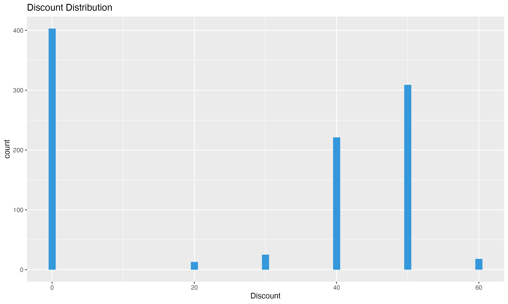
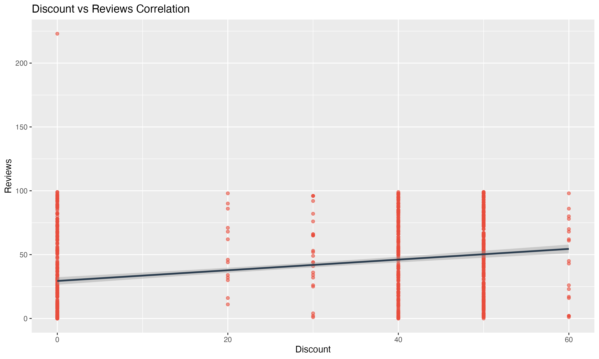
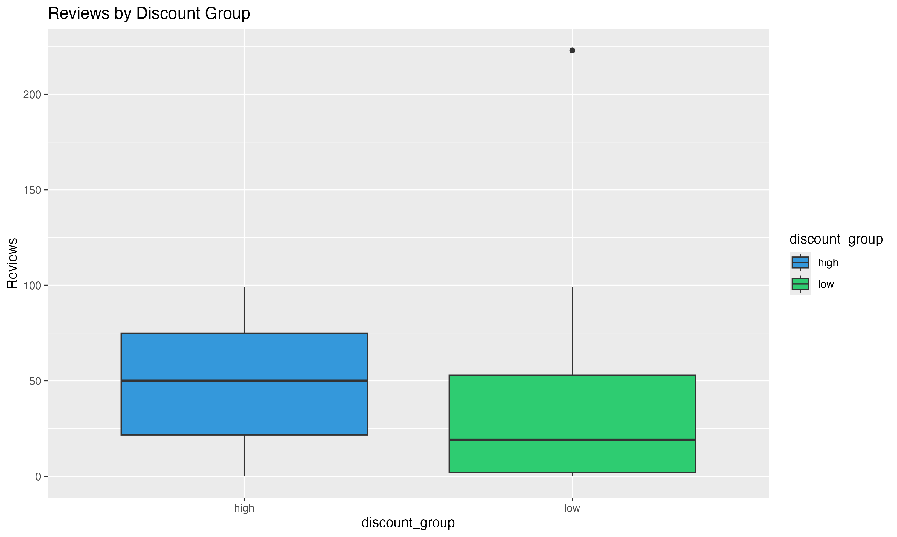
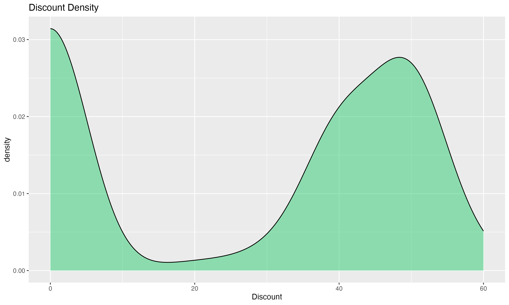

# 📊 Discount Impact Analysis

[](https://www.r-project.org/)
[](LICENSE)

Analyzing the relationship between product discounts and customer reviews for Nike/Adidas products.

## 🔍 Project Overview
- **Hypothesis**: Do product discounts influence customer engagement (reviews)?
- **Dataset**: [Nike vs Adidas from Kaggle](https://www.kaggle.com/datasets/mariyamalshatta/nike-vs-addidas-unspervised-clustering)
- **Key Findings**:
  - Weak positive correlation (r = 0.296) 
  - Significant mean difference in reviews (p < 0.001)
  - High-discount products had 42.7 more reviews on average

## 📂 Repository Structure

```
project-root/
├── analysis.Rmd # Full R Markdown analysis
├── plots/ # Generated visualizations
├── data/ # Dataset (gitignored)
├── README.md # This documentation
└── style.css # Custom formatting
```

## 🛠️ Installation & Usage
```bash
# Clone repository
git clone https://github.com/a4ahad/Discount-Impact-Reviews-Analysis.git

# Install dependencies
install.packages(c("ggplot2", "dplyr", "tidyr", "kableExtra"))
```

## 📈 Key Visualizations

## 📈 Key Visualizations

| Histogram        | Scatter Plot        |
|-----------------|---------------------|
|  |  |

| Boxplot         | Density Plot        |
|-----------------|---------------------|
|  |  |


## 📌 Results Summary

- **Statistical Significance:** `p < 2.2e-16 (t = 9.127)`
- **Practical Impact:** `+43 reviews per 10% discount increase`
- **Recommendation:** **Target 15-20% discounts** for optimal ROI

## 📄 License

**MIT License** - See [LICENSE](./LICENSE) for details

## 🌐 Connect

[LinkedIn Profile](https://www.linkedin.com/in/md-abdul-ahad-62b050305/)

[](https://opensource.org/licenses/MIT)